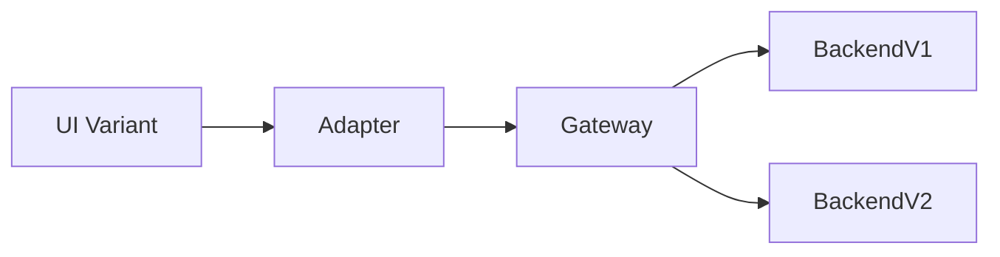
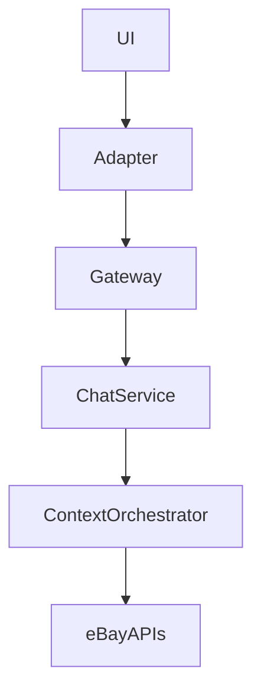

# 🧩 eBay Unified Chat Platform

---

## 🎯 Objective

Build a **reusable, extensible chat platform** that any eBay team can integrate with minimal effort while enabling:

* Independent UI and backend evolution
* Multi-framework support (React, Marko, Native)
* Low-latency real-time experience
* Vendor and backend flexibility

**Consumers:** eBay Live, Support, Comments, Transactions

---

## ⚠️ Problem Statement

At a high level, we wanted to provide **one unified chat experience (UI + service)** that could be reused across very different product surfaces at eBay.

However, each team had **different constraints and backend setups**:

### 1. eBay Live (Real-time streaming)

* Already had a **GraphQL gateway**
* Required a **single persistent socket connection**
* Used **STOMP protocol** over WebSocket
* Needed high-throughput, low-latency fan-out

---

### 2. Comments (asynchronous chat)

* Same core concept as chat
* Different UX (no real-time guarantees required)
* Same backend logic, slightly different interaction model

👉 Essentially: *chat → comment service reuse*

---

### 3. Customer Support Chat (legacy system)

* Already had an **existing backend**
* Could not migrate immediately
* Needed:

  * Old chats → existing backend
  * New chats → new chat service

👉 **Same UI, multiple backends simultaneously**

---

## 🚨 Core Challenge

> How do we support **multiple backends, protocols, and product needs**
> while exposing **one consistent UI and integration model**?

Without:

* Forcing teams to rewrite UI
* Locking into a single vendor/backend
* Coordinating migrations across org

---

## 🧠 Key Insight

> The problem is not chat.
> The problem is **decoupling UI from backend variability.**

---

## 💡 Solution: Chat Adapter

We introduced a **Chat Adapter** as the central abstraction.

* Acts like a **Java-style interface**
* Implemented per host/team
* Decides:

  * WebSocket (STOMP)
  * GraphQL subscriptions
  * REST polling
  * Legacy backend

👉 UI depends only on this interface, not the backend.

---

## 🏗️ High-Level Architecture (Miro-style)

```
+----------------------+
|      CLIENT          |
|----------------------|
|  Chat UI             |
|      │               |
|      ▼               |
|  Chat Adapter        |
|  - Protocol abstraction
|  - Backend switching |
|  - Reconnect logic   |
+----------│-----------+
           │
           ▼
+------------------------------+
|   CHAT GATEWAY              |
|------------------------------|
|  - WebSocket / GraphQL      |
|  - Auth & routing           |
|  - Experimentation          |
+-------------│----------------+
              │
              ▼
+------------------------------+
|        CHAT SERVICE          |
|------------------------------|
|  - Message normalization     |
|  - Business policies         |
|  - Fan-out orchestration     |
+------│-----------│-----------+
       │           │
       ▼           ▼
   [Redis]     [Database]

              │
              ▼
        Vendor / Legacy Backend
```

---

## 🧩 Integration Model

```tsx
<ChatProvider adapter={adapter}>
  <ChatUI />
</ChatProvider>
```

👉 Each team only implements the adapter.

---

## 🧱 Adapter Contract

```ts
interface ChatAdapter {
  listMessages(): Promise<Messages>;
  sendMessage(input): Promise<Message>;
  subscribe(onEvent): Unsubscribe;
}
```

**Why this works:**

* Small and stable API
* Abstracts transport + backend
* Enables multiple implementations

---

## 🔀 How This Solves the Problem

| Use Case     | Adapter Implementation      |
| ------------ | --------------------------- |
| eBay Live    | STOMP over WebSocket        |
| Comments     | REST / async model          |
| Support Chat | Legacy + new backend switch |

👉 Same UI, different adapters

---

## ⚙️ Backend Responsibilities

| Layer        | Responsibility                 |
| ------------ | ------------------------------ |
| Gateway      | Auth, routing, experimentation |
| Chat Service | Normalization, orchestration   |
| Backend      | Vendor OR legacy OR in-house   |

---

## 🧪 Experimentation Model



* UI experiments → client
* Backend experiments → gateway

👉 Fully decoupled experimentation

---

## 🧠 Context-Aware Chat



* Business logic lives in backend
* UI remains reusable

---

## ⚡ Performance Strategy

* Persistent connections (WebSocket)
* Optimistic UI updates
* Pub/Sub fan-out (Redis/Kafka)
* Gateway normalization

---

## ⚖️ Trade-offs

**Accepted**

* Adapter implementation per team
* Extra platform layers

**Avoided**

* Vendor lock-in
* UI rewrites
* Coordinated migrations

---

## 📈 Impact

* Unified chat integration across eBay
* Enabled gradual migration from legacy → new systems
* Reduced duplication across teams
* Faster experimentation
* Scalable real-time infrastructure

