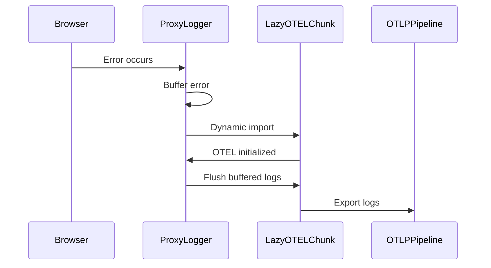
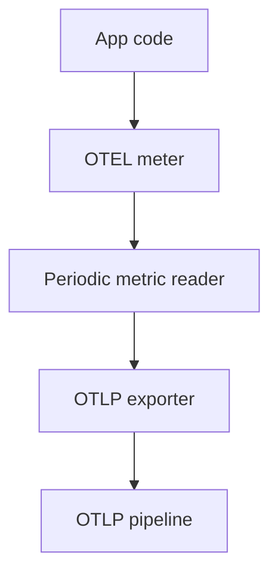
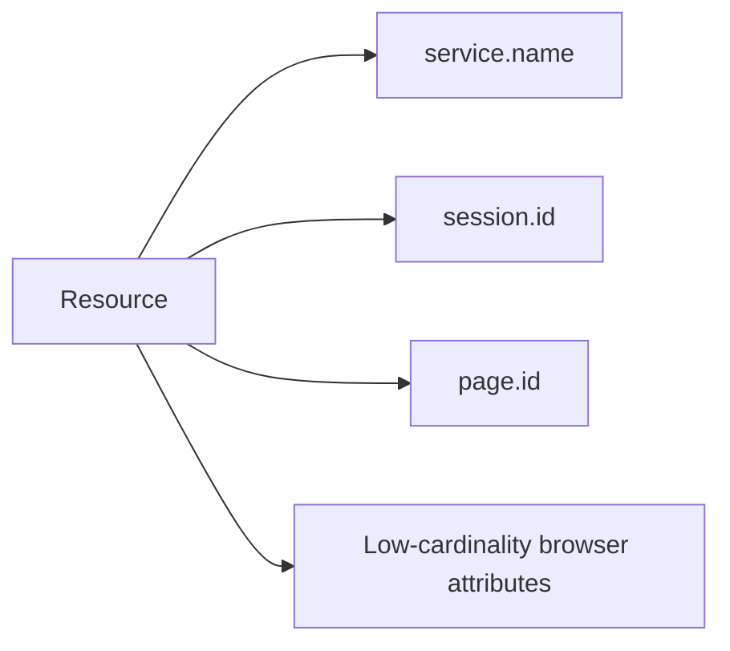
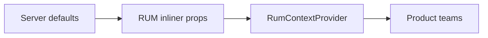

Below is a **clean, presentation-ready rewrite** in **proper Markdown**, with **correct Mermaid syntax**, clear sectioning, and Uber-appropriate tone.
I fixed formatting issues, normalized headings, tightened language, and ensured every Mermaid block will render correctly.

You can drop this directly into a doc, Miro, or HackerRank.

---

````md
# Real User Monitoring (RUM) Platform  
## Design, Architecture, and Organizational Impact

---

## 1. Executive Summary

This project addressed a systemic gap in frontend observability across the organization.

While backend services already emitted OpenTelemetry (OTEL) signals with mature ingestion pipelines and dashboards, frontend applications lacked a reliable and standardized way to capture real user failures. This created blind spots during incidents, duplicated effort across teams, and led to inconsistent observability quality.

I designed and led a client-side RUM platform that:

- Standardized frontend observability on OpenTelemetry
- Minimized browser performance impact
- Remained reliable even when applications failed to load
- Leveraged existing backend observability infrastructure

Adoption scaled from three initial teams to over **120 applications**, covering approximately **95% of all UI applications**, including both external customer-facing surfaces and internal tools.

---

## 2. Problem Statement

### Observed Issues

- Fragmented frontend logging implementations across teams  
- No consistent schema or lifecycle management  
- Critical failures during SSR and hydration were invisible  
- Frontend observability disconnected from backend OTEL pipelines  
- High integration friction discouraged consistent adoption  

### Organizational Impact

These gaps slowed incident response, increased operational load for SREs, and prevented end-to-end visibility across the stack, directly impacting reliability and developer productivity.

---

## 3. Goals and Constraints

### Goals

- Make observability a default outcome, not a per-team responsibility  
- Capture failures even when applications fail to load  
- Minimize performance impact in the browser  
- Standardize on OpenTelemetry for long-term extensibility  
- Enable organization-wide adoption with minimal configuration  

### Constraints

- Browser bundle size and performance budgets  
- CSP and SSR execution environments  
- Heavy OpenTelemetry JavaScript SDK  
- Metrics cardinality and cost considerations  
- Legacy build systems (Lasso, Webpack 3)  

---

## 4. High-Level Platform Architecture

```mermaid
flowchart LR
  subgraph ORG["Organization scale"]
    Apps["120+ UI applications"]
  end

  subgraph BROWSER["Browser runtime"]
    Inline["SSR inline bootstrap"]
    Runtime["RUM client runtime"]
    Lazy["Lazy-loaded OTEL"]
  end

  subgraph PLATFORM["Shared observability platform"]
    OTLP["OTLP pipelines"]
    Dashboards["Sherlock dashboards"]
  end

  Apps --> Inline
  Inline --> Runtime
  Runtime --> Lazy
  Lazy --> OTLP
  OTLP --> Dashboards
````

---

## 5. Reliability Under Failure: SSR Inline Logging

Most critical frontend failures occur before or during application load.
To ensure observability in these scenarios, a minimal logging bootstrap is inlined during server-side rendering.

```mermaid
sequenceDiagram
  participant HTML
  participant Inline as InlineBootstrap
  participant App as ClientBundle
  participant OTLP as OTLPPipeline

  HTML->>Inline: Inline script executes
  Inline->>Inline: Attach error listeners
  Inline->>Inline: Buffer errors
  App--x Inline: Client bundle fails to load
  Inline->>OTLP: Emit buffered errors
```

This guarantees visibility even when the application never fully initializes.

---

## 6. Performance Trade-Off: Lazy Loading OpenTelemetry

OpenTelemetry provides standardization and extensibility, but introduces significant bundle weight in the browser.
To protect performance budgets, OTEL is loaded lazily.



This preserves Core Web Vitals while ensuring no loss of critical signals.

---

## 7. Metrics Architecture

Metrics are implemented using OpenTelemetry’s `MeterProvider` with explicit lifecycle management to control cost and cardinality.



### Resource Model



---

## 8. Adoption Strategy

### Initial Validation

* Started with three teams within my organization
* Selected **ViewItem**, one of the largest and most business-critical UI surfaces
* Validated the approach on the ViewItem Light Page under strict performance constraints

This phase de-risked the architecture and demonstrated feasibility at scale.

---

## 9. Organization-Wide Scale



### Adoption Outcome

* Expanded from three teams to over **120 applications**
* Approximately **95% coverage** of all UI applications
* Included both external customer-facing applications and internal tools

The RUM platform became the standard integration path for frontend observability.

---

## 10. Cross-Functional Leadership

* Partnered early with SRE teams to align on OTEL semantics and operational expectations
* Leveraged existing backend OTEL pipelines and Sherlock dashboards
* Avoided building parallel observability systems, accelerating time-to-value

---

## 11. Enablement and Sustainability

* Delivered internal talks and platform onboarding sessions
* Held regular office hours to support complex and legacy integrations
* Actively supported applications using Lasso and Webpack 3

### Knowledge Scaling

* Trained internal GPT models on RUM code, docs, and integration guides
* Enabled self-service onboarding for new applications
* Reduced ongoing support needs as adoption scaled

---

## 12. Extensibility and Future Work

* Resource model and lifecycle hooks designed to support client-side tracing
* Tracing intentionally deferred to prioritize stability and adoption
* Architecture prepared for future expansion without breaking changes

---

## 13. Impact Summary

| Dimension             | Outcome                                  |
| --------------------- | ---------------------------------------- |
| Scope                 | 120+ applications (~95% of UI)           |
| Reliability           | Error capture during application failure |
| Performance           | Lazy-loaded OTEL                         |
| Cost Control          | Low-cardinality metrics                  |
| Productivity          | No-config integration                    |
| Organizational Impact | Default frontend observability platform  |

---

## 14. Conclusion

This work transformed frontend observability from fragmented, ad hoc implementations into a standardized, scalable platform. By leveraging existing infrastructure, prioritizing reliability and performance, and focusing on developer experience, observability became a default capability across nearly all UI applications in the organization.

```

---
