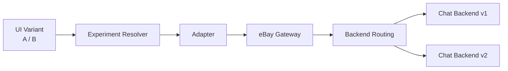
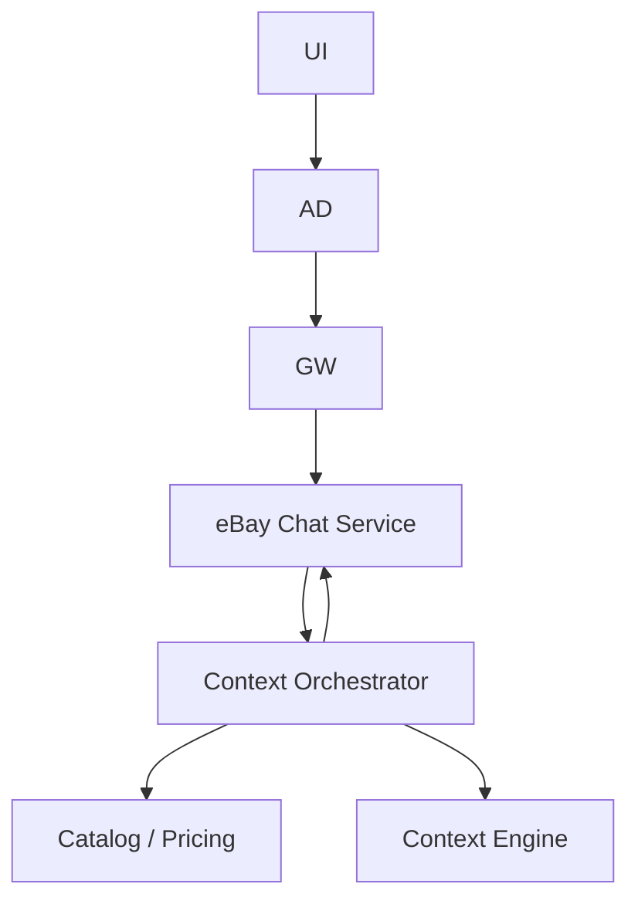

# eBay Unified Chat Platform

**Staff-level Frontend Architecture**

## Scope

**Platform capability usable by all teams within eBay**
(Web: React + Marko, Native clients)

Initial consumers:

* eBay Live
* eBay Support
* eBay Auction / Transactions

---

## Problem Statement

> Create a **single chat platform** that any eBay team can integrate with **minimal effort**, while:

* Avoiding **vendor lock-in**
* Supporting **indepen                                                                                                                                                                                                                                                                          /*//a/dent UI & backend A/B tests**
* Enabling **context-aware chat**
* Meeting **strict latency targets**
* Working across **React, Marko, and Native**

---

## Key Constraints

* Vendor required short-term (time to market)
* Native apps impose long SDK support windows
* Teams operate independently with different stacks
* Experiments must compose (UI × backend)

---

## Vendor-First Architecture (Rejected)


**Issues**

* UI tightly coupled to vendor SDK & hooks
* No clean UI / backend experiment boundary
* Native SDK lock-in (2+ years)
* Poor Marko + plain JS support

---

## Final Architecture (Platform Model)

```mermaid
flowchart LR
  subgraph Clients
    R[React]
    M[Marko]
    N[Native]
  end

  subgraph Host
    A[Chat Adapter\n(host-owned)]
  end

  subgraph eBay
    G[eBay Chat Gateway]
    S[eBay Chat Service]
  end

  subgraph Vendor
    V[Stream Backend]
  end

  R --> A
  M --> A
  N --> A

  A --> G --> S --> V
```

**Core idea:**
👉 UI never talks to vendor
👉 UI talks to a **stable adapter contract**
👉 Vendor becomes an implementation detail

---

## Frontend Platform Boundary

```mermaid
flowchart TB
  subgraph Host App
    H[Surface Integration]
    AD[Chat Adapter\nImplementation]
  end

  subgraph Chat Platform
    P[ChatProvider]
    UI[Chat UI\n(React / Marko)]
    ST[Chat Store]
    CT[Shared Types & Contracts]
  end

  H --> AD --> P
  P --> UI
  P --> ST
  ST --> UI
  CT --- UI
  CT --- AD
```

**Ownership**

* **Platform owns UI + contracts**
* **Host owns adapter**
* **Backend is fully abstracted**

---

## Chat Adapter (Core Abstraction)

> This is the *only* required integration point.

```tsx
<ChatProvider adapter={adapter}>
  <ChatUI />
</ChatProvider>
```

### Adapter Contract (Highlighted)

```ts
export interface ChatAdapter {
  listMessages(input: {
    beforeId?: string;
    limit?: number;
  }): Promise<{
    messages: ChatMessage[];
    hasMore: boolean;
  }>;

  sendMessage(input: {
    text: string;
    localId: string;
  }): Promise<ChatMessage>;

  subscribe(
    onEvent: (event: ChatEvent) => void
  ): () => void;
}
```

**Why this works**

* Minimal surface area
* Transport-agnostic (REST, WS, GraphQL)
* Framework-agnostic (React, Marko, Native)
* Stable across vendor swaps

---

## A/B Testing (UI × Backend, Order-Independent)



* UI experiments resolved client-side
* Backend experiments resolved at gateway/service
* No cross-coupling or combinatorial explosion

---

## Context-Aware Chat (eBay Intelligence)



* UI renders messages only
* Context logic fully backend-owned
* Reusable across Live, Support, Auction

---

## Multi-Framework Strategy

```mermaid
flowchart LR
  C[Chat Core\n(State + Contracts)]
  R[React Renderer]
  M[Marko Wrapper]
  N[Native Client]

  C --> R
  C --> M
  C --> N
```

* One contract
* Multiple renderers
* No vendor SDK leakage into UI

---

## Performance Targets

* **P50 server RTT < 200ms**
* **Client perceived RTT < 800ms**

Achieved via:

* Gateway normalization
* Optimistic UI (store-level)
* Small initial payloads
* Long-lived connections where needed

---

## Trade-offs

**Pros**

* Vendor lock-in removed
* Clean experimentation boundaries
* Cheap onboarding for new teams
* Incremental path to in-house backend

**Cons**

* Adapter implementation required per surface
* Platform ownership (gateway + service)
* Contract discipline required

---

## Why This Is Staff-Level

* Designed as a **platform**, not a feature
* Explicit boundaries for ownership & evolution
* Optimizes for **change velocity**, not just delivery
* Solves experimentation, migration, and scale together

---

# Appendix

## A. Message Send Lifecycle

```mermaid
sequenceDiagram
  participant UI
  participant Adapter
  participant Gateway
  participant Service
  participant Vendor

  UI->>Adapter: sendMessage
  Adapter->>Gateway: POST /messages
  Gateway->>Service
  Service->>Vendor
  Vendor-->>Service
  Service-->>Adapter
  Adapter-->>UI
```

---

## B. Subscription Flow

```mermaid
sequenceDiagram
  participant Provider
  participant Adapter
  participant Gateway
  participant Service

  Provider->>Adapter: subscribe
  Adapter->>Gateway: open socket
  Service-->>Gateway: events
  Gateway-->>Adapter
  Adapter-->>Provider
```

