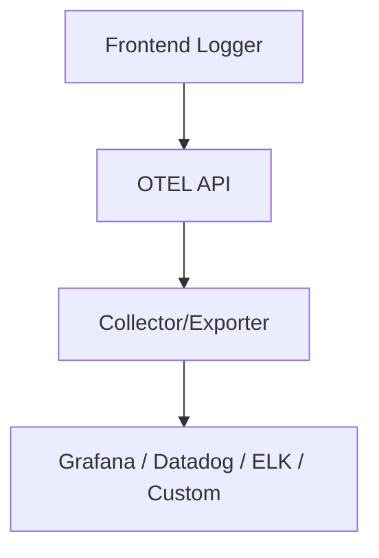
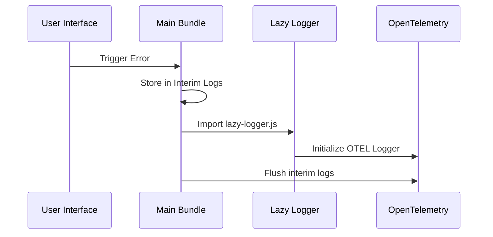

# 📊 Client Observability Strategy at Scale (with JavaScript)

## 🧭 Introduction

**Client observability** helps us understand what users experience in the browser. It enables us to answer questions like:

* ❓ What errors are occurring on the frontend?
* 🧍‍♂️ How many users are seeing a broken UI?
* ⚠️ Are we aware of both handled and unhandled errors?

This strategy document explains observability using **JavaScript**, leveraging **OpenTelemetry (OTEL)** and **lazy loading** to preserve performance.

---

## 🔍 What is Observability?

Observability means capturing information from the client to understand system health. In the frontend, this typically includes:

* ❌ **Unhandled Errors** (e.g., JavaScript exceptions)
* ⛔ **Unhandled Promise Rejections**
* 🛠 **Handled Errors** (logged manually)

---

## 🧰 Basic Logger Setup

Start with a simple logger that captures global errors:

```javascript
class Logger {
  error(event) {
    // Send AJAX call to backend
  }
}

const logger = new Logger();

window.addEventListener("error", function (event) {
  logger.error(event);
});

window.addEventListener("unhandledrejection", function (event) {
  logger.error(event);
});
```

### ✅ Pros

* ⚡ **Lightweight** and easy to integrate
* 🔍 Captures most frontend failures

### ❌ Cons

* 🌐 Everything is **global** and **unstructured**
* 📡 Generates **too many network calls**
* ❓ Lacks **contextual metadata**
* 🧳 Not portable across different backends. Needs an inhouse backend

---

## 📐 Why Follow Standards?

Use the **OpenTelemetry (OTEL)** standard for a modern, scalable observability setup.

### 🎯 Benefits:

* 🌍 Emits data in a **universal format**
* 🔌 **Pluggable backends** (Grafana, Datadog, custom pipelines)
* 📈 Supports **logs**, **metrics**, and **traces**
* 🤝 Improves **cross-team collaboration**



---

## 🧪 Basic OTEL Logger Example

Simple OpenTelemetry logging in JavaScript:

```javascript
import { LoggerProvider } from "@opentelemetry/sdk-logs";

const logger = new LoggerProvider({
  endpoint: "https://www.otel-endpoint.com",
});

window.addEventListener("error", (event) => logger.error(event));
window.addEventListener("unhandledrejection", (event) => logger.error(event));
```

---

## ⚠️ Real Challenge: OTEL Is Heavy

OTEL adds significant bundle size due to dependencies:

```javascript
import {
  LoggerProvider,
  PeriodicExportingMetricReader
} from "@opentelemetry/sdk-logs";

import { OTLPLogExporter } from "@opentelemetry/exporter-logs-otlp-http";

// Full logger setup with exporting config
const meterProvider = new LoggerProvider({
  readers: [
    new PeriodicExportingMetricReader({
      exporter: new OTLPLogExporter({
        url: "https://your-export-endpoint.com",
      }),
    }),
  ],
});
```

> 🧱 This adds **a lot of weight** to the client bundle.

---

## 🐢 Solution: Lazy Load the Logger

Defer loading OTEL with **code-splitting** and **dynamic import**.

### 1️⃣ Create Lazy Logger Module

```javascript
// lazy-logger.js
import { LoggerProvider } from "@opentelemetry/sdk-logs";

const logger = new LoggerProvider({
  endpoint: "https://www.otel-endpoint.com",
});

export { logger };
```

### 2️⃣ Wrap with a Proxy Logger

```javascript
// index.js
class Logger {
  constructor() {
    this.interimLogs = [];
    this.loadLazyLogger();
  }

  async loadLazyLogger() {
    const lazyLogger = await import(
      /* webpackChunkName: "lazy-logger" */ './lazy-logger.js'
    );
    this.logger = lazyLogger;
    this.interimLogs.forEach((log) => lazyLogger.logger.error(log));
    this.interimLogs = [];
  }

  error(log) {
    if (this.logger) {
      this.logger.logger.error(log);
    } else {
      this.interimLogs.push(log);
    }
  }
}

export const initializeLogger = () => {
  const logger = new Logger();

  window.addEventListener("error", (event) => logger.error(event));
  window.addEventListener("unhandledrejection", (event) => logger.error(event));

  return logger;
};
```

### 📈 Lazy Logger Workflow



---

## ⚛️ How to Use in a React Component

```javascript
import { useEffect } from 'react';
import { initializeLogger } from 'otel-logger';

export default function SomeRandomComponent() {
  useEffect(() => {
    const logger = initializeLogger();

    fetch('/api/some-endpoint')
      .then(res => res.ok || Promise.reject('API failed'))
      .catch(err => logger.error(err));
  }, []);

  return <>Random Component</>;
}
```

---

## 🛡️ Final Safeguard: Server-Side Inlining

If the **client bundle fails**, observability may break.

### ✅ Solution: Inline Initial Logging

```html
<script>
  class Logger {
    constructor() {
      this.interimLogs = [];
      this.loadLazyLogger();
    }

    async loadLazyLogger() {
      const lazyLogger = await import('/lazy-logger.js');
      this.logger = lazyLogger;
      this.interimLogs.forEach(log => lazyLogger.logger.error(log));
      this.interimLogs = [];
    }

    error(log) {
      if (this.logger) {
        this.logger.logger.error(log);
      } else {
        this.interimLogs.push(log);
      }
    }
  }

  const logger = new Logger();
  window.addEventListener("error", (event) => logger.error(event));
  window.addEventListener("unhandledrejection", (event) => logger.error(event));
</script>

<script src="/client-bundle.js"></script>
```

> 🧬 This ensures **basic logging** works even if your app fails to load, ideal for **SSR (server-side rendering)**.

---

## ✅ Summary

| 🧩 Aspect           | 💡 Strategy                                   |
| ------------------- | --------------------------------------------- |
| Error Capturing     | Global listeners for error & rejection        |
| Logging Standard    | Use OTEL for portability & extensibility      |
| Bundle Size Concern | Lazy load OTEL to reduce impact               |
| Reliability         | Inline fallback ensures minimal observability |

---
