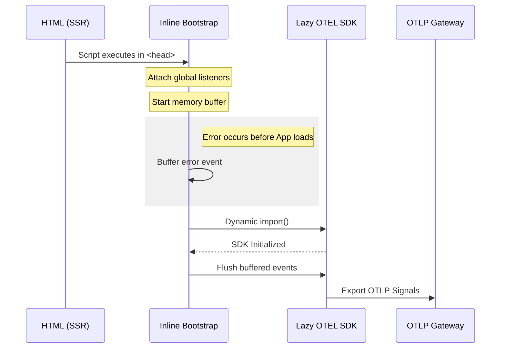
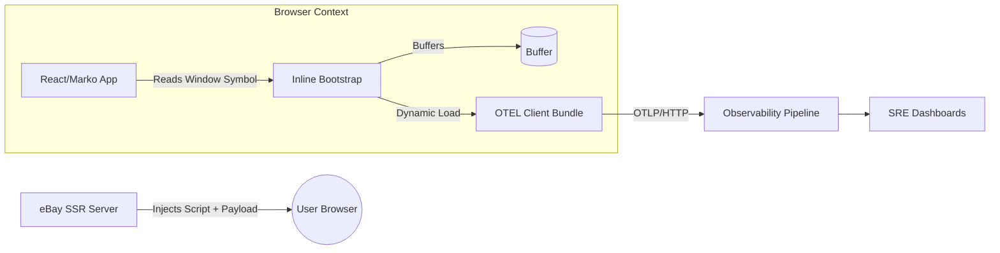

# Unified Frontend Observability: A Platform-First Approach

This platform was designed to eliminate the observability gap as an organizational tax. By moving away from an opt-in model, we turned frontend monitoring into a core platform primitive. It currently supports over **120 applications** and **95% of UI surfaces**, ensuring that critical failures—even those occurring during the "dead zone" of SSR and hydration—are captured with zero impact on user-perceived performance.

### The Challenge: Solving for Systemic Visibility

Before this initiative, our frontend observability was fragmented. Teams built bespoke logging solutions with inconsistent schemas, and errors occurring during initial page load were essentially invisible. This created a significant "blind spot" for SREs, as frontend failures couldn't be correlated with backend OpenTelemetry (OTEL) traces.

The goal was to build a system that was **execution-guaranteed**. At our scale, the network is a dependency we cannot always trust; if the main JavaScript bundle fails to load, observability must still function.

---

### High-Level Architecture

I architected a multi-stage system to resolve the fundamental conflict between comprehensive data collection and browser performance budgets.



| Component | Technical Role | Strategic Purpose |
| --- | --- | --- |
| **The Sentinel** | Inlined SSR Script | Guaranteed capture; removes the network as a single point of failure for observability. |
| **The Heavy Lifter** | Lazy-loaded OTEL Bundle | Decouples complex SDK logic from the critical rendering path to protect FID/LCP. |
| **The Bridge** | Framework NPM Module | Decouples application code from the logging engine for future-proofed migrations. |

---

### 1. The Sentinel: Execution-Guaranteed Capture

The "Sentinel" is a zero-dependency script injected during SSR. By running in the document head before any application code, it captures the "Top-of-Page" failures that are traditionally the hardest to debug, such as CDN failures, CSP violations, or hydration mismatches.

**Configuration Ownership:** I shifted configuration ownership to the server. By passing environment metadata via `data-inlinepayload`, we eliminate configuration drift. Frontend logs are automatically tagged with the correct backend service context and deployment pool at the moment of injection.

```html
<script
  data-inlinepayload='{
    "serviceName": "ebay-checkout-web",
    "endpoint": "prod-otlp-gateway",
    "pool": "checkout-pool-01",
    "serviceVersion": "2.4.5"
  }'
>
(function () {
  const RUM_SYMBOL = Symbol.for("ebay.rum");
  const payload = document.currentScript?.dataset?.inlinepayload;
  const rumConfig = payload ? JSON.parse(payload) : {};

  const buffer = [];
  let otelLogger = null;

  const logger = {
    error(event) {
      if (otelLogger) {
        otelLogger.error(event);
      } else {
        buffer.push(event); // Buffer errors until SDK is ready
      }
    },
  };

  window[RUM_SYMBOL] = { logger };

  window.addEventListener("error", (e) => logger.error(e));
  window.addEventListener("unhandledrejection", (e) => logger.error(e));

  (async function loadOtel() {
    try {
      const otel = await import("/rum-otel-client.js");
      otelLogger = otel.initializeLogger(rumConfig);

      for (const event of buffer) {
        otelLogger.error(event);
      }
      buffer.length = 0;
    } catch {
      // Platform-level fail-open logic
    }
  })();
})();
</script>

```

---

### 2. The Bridge: Decoupling Application from Engine

To allow the platform to evolve without breaking 120+ apps, I delivered the integration via a thin framework "Bridge" (npm module). This bridge serves as a stable abstraction layer.

By using a `Symbol` to resolve the global Sentinel, the application layer remains completely unaware of how the logging engine is loaded or implemented. This allows us to swap the underlying OTEL SDK or change ingestion endpoints globally by simply updating the platform-controlled chunks, requiring no changes from product teams.

```ts
// Inside @ebay/rum-react (The Bridge)
const RUM_SYMBOL = Symbol.for("ebay.rum");

export const useRumContext = () => {
  const runtime = window[RUM_SYMBOL];
  
  if (!runtime) {
    return { logger: { error: () => {} } }; // Safe fallback
  }

  return { logger: runtime.logger };
};

```

---

### System Integration and Scale

The architecture provides a "Single-Pane-of-Glass" view. Because the server injects backend trace IDs into the Sentinel’s payload, we can finally correlate a browser crash directly to a specific backend microservice failure.



### Impact and Operational Results

* **Reliability:** Captured failures during the "dead zone" of application initialization that were previously 100% invisible.
* **Performance:** Achieved universal coverage with zero regression in First Input Delay (FID) by deferring SDK initialization to idle time.
* **MTTR Reduction:** By unifying schemas and enabling cross-stack correlation, SREs can now identify the root cause of frontend-impacting incidents in minutes rather than hours.
* **Developer Velocity:** We turned a complex, multi-day instrumentation task into a zero-click platform default.

---

**Next Step for the Interview:** We could discuss the **Head-Based Sampling** strategy I implemented to manage the massive data volume from 120 apps while keeping infrastructure costs controlled. Would you like to cover that?