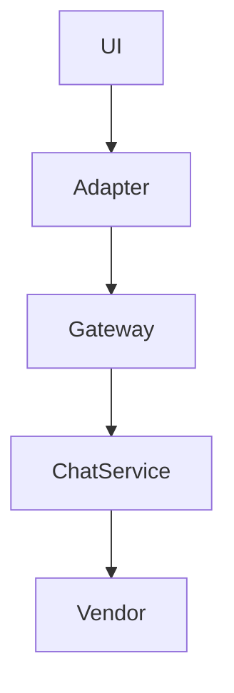
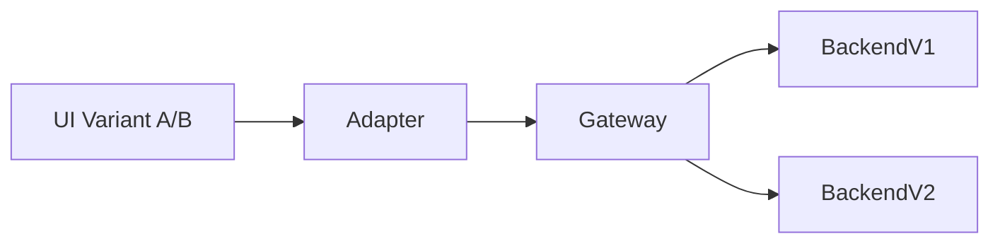
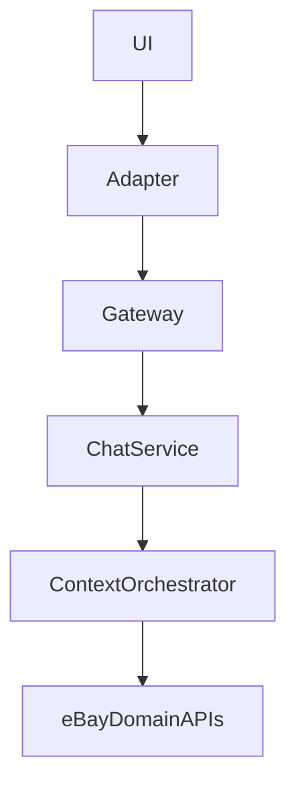

# eBay Unified Chat Platform

**Architecture Story**

---

## Objective

Enable any eBay team to integrate real-time chat with minimal effort, while supporting:

* Long-term extensibility
* Independent UI and backend experimentation
* Multi-framework support (React, Marko, Native)
* Low-latency user experience at scale

Initial consumers:

* eBay Live
* eBay Support
* eBay Auction / Transactions

Scope:

* Platform capability available to all teams within eBay

---

## Core Challenges

* Vendor SDKs tightly coupled UI and backend
* Native SDKs implied multi-year vendor lock-in
* Teams required simultaneous but independent experimentation
* Existing legacy and vendor-managed chat systems needed coexistence

The primary challenge was enabling change across teams without forcing coordinated rewrites.

---

## Design Principle

**Own the integration boundary.**

UI should depend on a stable, eBay-owned contract.
Vendors and backend implementations should remain replaceable.

---

## Final Architecture

```mermaid
flowchart LR
  subgraph Clients
    R[React]
    M[Marko]
    N[Native]
  end

  A[Chat Adapter\n(host-owned)]

  G[eBay Chat Gateway]
  S[eBay Chat Service]

  V[Vendor Backend\n(Stream)]

  R --> A
  M --> A
  N --> A

  A --> G --> S --> V
```

UI never communicates directly with vendor services.
All traffic flows through an adapter and eBay-owned services.

---

## Integration Model

```tsx
<ChatProvider adapter={adapter}>
  <ChatUI />
</ChatProvider>
```

The adapter is the only required integration point for a surface.

---

## Adapter Contract

```ts
interface ChatAdapter {
  listMessages(): Promise<Messages>;
  sendMessage(input): Promise<Message>;
  subscribe(onEvent): Unsubscribe;
}
```

Characteristics:

* Small and stable API surface
* Transport-agnostic
* Framework-agnostic
* Consistent across web and native clients

---

## Backend Composition



Responsibilities:

* Gateway: authentication, routing, experimentation
* Chat Service: normalization, policies, extensibility
* Vendor: message delivery and fan-out

---

## Experimentation Model



* UI experiments are resolved client-side
* Backend experiments are resolved at gateway/service level
* UI and backend variants compose independently

---

## Context-Aware Chat



Context intelligence (catalog, pricing, transaction state) is handled entirely on the backend.
UI renders messages without embedding business logic.

---

## Multi-Framework Support

```mermaid
flowchart LR
  Core[Chat Core\n(Contracts + State)]
  ReactUI[React Renderer]
  MarkoUI[Marko Wrapper]
  NativeUI[Native Client]

  Core --> ReactUI
  Core --> MarkoUI
  Core --> NativeUI
```

A single contract supports multiple rendering environments without duplication.

---

## Performance Targets

* P50 server RTT < 200ms
* Client perceived RTT < 800ms

Achieved through:

* Optimistic UI updates
* Gateway normalization
* Incremental message loading
* Long-lived connections where applicable

---

## Trade-offs

Chosen:

* Adapter implementation per surface
* Additional platform components (gateway, service)

Avoided:

* Vendor SDK lock-in
* UI rewrites during backend migrations
* Coupled experimentation across layers

The architecture prioritizes long-term flexibility and organizational velocity.

---

## Organizational Impact

* Teams integrate chat through a single, consistent contract
* Reduced duplication across surfaces
* Faster experimentation and iteration
* Clear migration path from vendor to in-house solutions
* Shared quality and performance guarantees across the platform

---

## Appendix

### Message Send Flow

```mermaid
sequenceDiagram
  participant UI
  participant Adapter
  participant Gateway
  participant Service
  participant Vendor

  UI->>Adapter: sendMessage
  Adapter->>Gateway
  Gateway->>Service
  Service->>Vendor
  Vendor-->>Service
  Service-->>Adapter
  Adapter-->>UI
```

### Subscription Flow

```mermaid
sequenceDiagram
  participant Provider
  participant Adapter
  participant Gateway
  participant Service

  Provider->>Adapter: subscribe
  Adapter->>Gateway: open connection
  Service-->>Gateway: events
  Gateway-->>Adapter
  Adapter-->>Provider
```