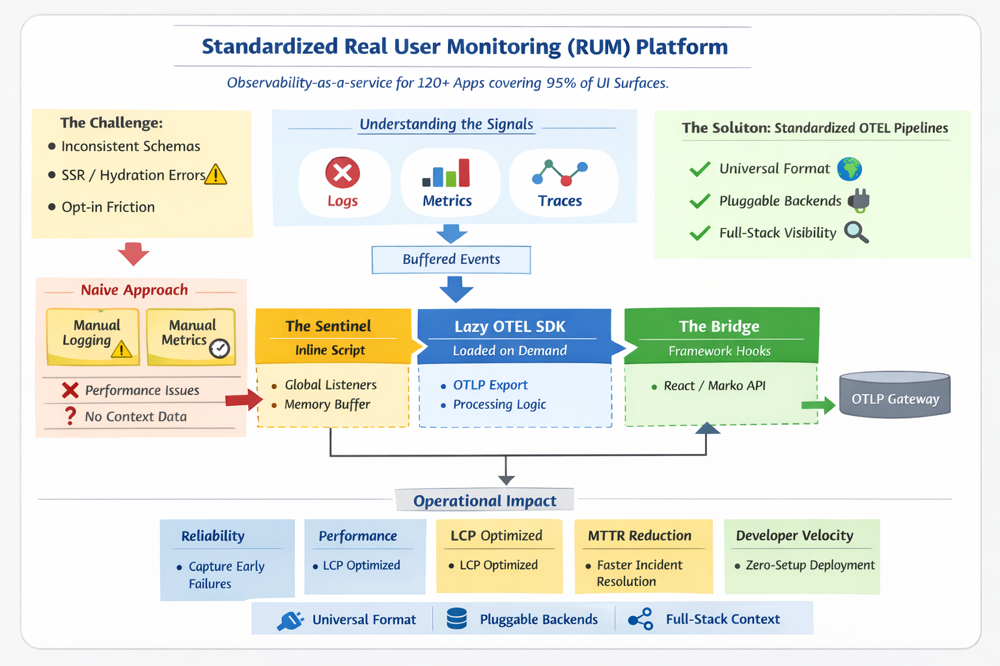
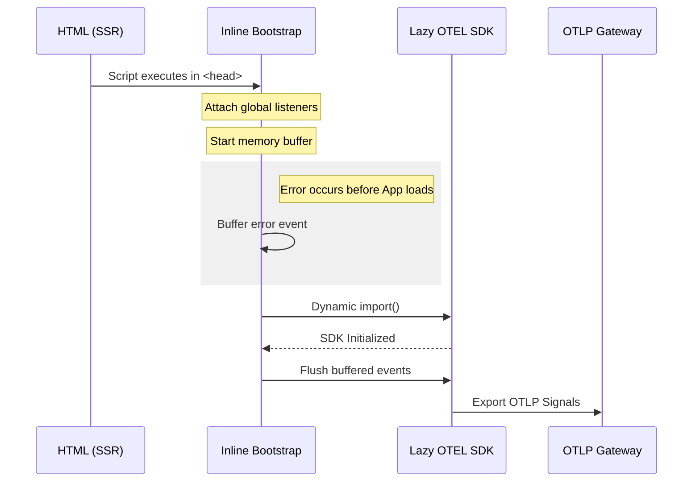

# Project: Standardized Real User Monitoring (RUM) Platform



This platform provides **observability-as-a-service** for the enterprise web stack. It currently powers **120+ applications**, covering **95% of the company's UI surfaces**.

### 🚩 The Challenge: The "Hydration Blind Spot"

Before this platform, frontend monitoring was fragmented and unreliable.

* 🧩 **Inconsistent Schemas:** Teams used different data formats, making it impossible to aggregate health metrics.
* 🌑 **The Blind Spot:** Errors during **Server-Side Rendering (SSR)** or **Hydration** went uncaptured because standard SDKs loaded too late.
* 🛠 **Opt-in Friction:** Developers had to manually set up API keys and service names for every new app.

Our goal was to move to a **Platform Primitive**: every app inherits observability by default without any manual configuration.

---

## 🔍 Understanding the Signals

We monitor three primary categories of telemetry:

* ❌ **Logs:** Unhandled exceptions and promise rejections.
* 📊 **Metrics (Meters):** Quantitative data like page load speed and memory usage.
* 🔗 **Traces:** Connecting frontend actions to backend **OpenTelemetry (OTEL)** spans.

---

## 🧰 The "Naive" Approach (And why it fails)

In a basic setup, a developer might manually listen for events. This is what we wanted to move away from:

### 1. Manual Error Logging

```javascript
class Logger {
  log(error) {
    // 📡 Immediate network call - unoptimized
    fetch('/telemetry/errors', { method: 'POST', body: JSON.stringify(error) });
  }
}

const logger = new Logger();

// Listen for runtime crashes
window.addEventListener("error", (e) => logger.log(e));
window.addEventListener("unhandledrejection", (e) => logger.log(e));

```

### 2. Manual Performance Metering

```javascript
class Meter {
  histogram({ name, value }) {
    // Used for timing/distribution (e.g., Latency)
    fetch('/metrics', { method: 'POST', body: JSON.stringify({ name, value, type: 'histogram' })});
  }
  counter({ name, value }) {
    // Used for cumulative sums (e.g., Page Views)
    fetch('/metrics', { method: 'POST', body: JSON.stringify({ name, value, type: 'counter' })});
  }
  gauge({ name, value }) {
    // Used for a snapshot in time (e.g., Memory Usage)
    fetch('/metrics', { method: 'POST', body: JSON.stringify({ name, value, type: 'gauge' })});
  }
}

const meter = new Meter();

window.addEventListener("load", () => {
  // Counter: Tracking a discrete event
  meter.counter({ name: "page-loaded", value: 1 });

  // Histogram: Tracking timing/latency
  meter.histogram({ name: "load-latency", value: performance.timing.loadEventEnd - performance.timing.navigationStart });

  // Gauge: Tracking current state of resources
  meter.gauge({ name: "heap-size", value: performance.memory?.totalJSHeapSize });
});
```
### ❌ Why this doesn't scale:

* 📉 **Performance:** Fires a global `fetch` request for every single event, which can hurt the user experience.
* ❓ **No Context:** Lacks metadata like Browser version, User Region, or Trace IDs.
* 🏗 **Custom Backend:** Requires an in-house backend to parse proprietary data formats instead of using industry standards.

---

## 📐 The Solution: Standardized OTEL Pipelines

By adopting the **OpenTelemetry (OTEL)** standard, we aligned the frontend with modern infrastructure.

* 🌍 **Universal Format:** Data is emitted in a vendor-neutral schema.
* 🔌 **Pluggable Backends:** Easily switch between Grafana, Datadog, or Honeycomb.
* 🤝 **Full-Stack Visibility:** We can now link a slow frontend click to a specific backend database query.

---

## 🧰 The "Naive" Approach (And why it fails)

In a basic setup, a developer might manually listen for events. We moved away from this because it lacks batching, context, and standardization.

### 1. Manual Error Logging

```javascript
class Logger {
  log(error) {
    // 📡 Immediate network call - unoptimized
    fetch('/telemetry/errors', { method: 'POST', body: JSON.stringify(error) });
  }
}
const logger = new Logger();
window.addEventListener("error", (e) => logger.log(e));
window.addEventListener("unhandledrejection", (e) => logger.log(e));

```

### 2. Manual Performance Metering

```javascript
class Meter {
  histogram({ name, value }) {
    fetch('/metrics', { method: 'POST', body: JSON.stringify({ name, value, type: 'histogram' })});
  }
  counter({ name, value }) {
    fetch('/metrics', { method: 'POST', body: JSON.stringify({ name, value, type: 'counter' })});
  }
  gauge({ name, value }) {
    fetch('/metrics', { method: 'POST', body: JSON.stringify({ name, value, type: 'gauge' })});
  }
}

```

### ❌ Why this doesn't scale:

* 📉 **Performance:** Fires a global `fetch` request for every single event, hurting UX.
* ❓ **No Context:** Lacks metadata like Browser version, User Region, or Trace IDs.
* 🏗 **Custom Backend:** Requires an in-house backend to parse proprietary data formats instead of industry standards.

---

## 📐 The Solution: Standardized OTEL Pipelines

By adopting **OpenTelemetry (OTEL)**, we aligned the frontend with modern infrastructure: **Universal Format**, **Pluggable Backends** (Grafana/Honeycomb), and **Full-Stack Visibility** (linking clicks to DB queries).

### "Zero-Setup" Implementation

The platform is **environment-aware**, automatically extracting `serviceName` and `environment` from server context.

**Example: React (Remix/SSR)**

```jsx
import { getRumServerProps } from '@ebay/react-rum/server';
import { RumInliner } from '@ebay/react-rum/client';

export async function loader() {
  const rumServerProps = getRumServerProps(); // Auto-detects metadata
  return { rumServerProps };
}

export default function App({ data }) {
  return (
    <html>
      <head>
        <RumInliner {...data.rumServerProps} />
      </head>
      <body><Outlet /></body>
    </html>
  );
}

```

---

## 🏗 Architecture Overview

The system is split into three decoupled artifacts to balance reliability with bundle size constraints.



### 1. The Inline Bootstrap (The "Sentinel")

A minimal, zero-dependency script inlined in the `<head>`.

* **Purpose:** Ensures the system is active before any app JS executes.
* **Logic:** Reads the `data-inlinepayload`, sets up a `Symbol.for("ebay.rum")` global, and buffers events until the SDK is ready.

```html
<script data-inlinepayload='{ "serviceName": "ebay-checkout-web", ... }'>
  (function () {
    const RUM_SYMBOL = Symbol.for("ebay.rum");
    const payload = document.currentScript?.dataset?.inlinepayload;
    const rumConfig = payload ? JSON.parse(payload) : {};
    const buffer = [];
    let otelLogger = null;

    const logger = {
      error(event) {
        otelLogger ? otelLogger.error(event) : buffer.push(event);
      },
    };

    window[RUM_SYMBOL] = { logger };
    window.addEventListener("error", (e) => logger.error(e));

    (async function loadOtel() {
      const otel = await import("https://www.ebay-cdn.com/rum-otel-client-d36ff0df.js");
      otelLogger = otel.initializeLogger(rumConfig);
      for (const event of buffer) { otelLogger.error(event); }
      buffer.length = 0;
    })();
  })();
</script>

```

### 2. Lazy OTEL Client Bundle

The "Heavy Lifter" containing the full OTEL SDK.

* **Why Lazy?** OTEL provides standardization but adds significant bundle weight. Keeping it out of the critical path protects performance budgets and allows global updates to sampling rates without redeploying individual apps.

### 3. Framework Integration (The "Bridge")

A thin npm module providing ergonomic hooks.

* **Why?** It allows developers to interact with the pre-initialized runtime without worrying about the underlying implementation or SDK lifecycle.

```javascript
import { useRumContext } from "@ebay/rum-react/client";

const CheckoutButton = () => {
  const { logger, meter } = useRumContext();
  const handlePayment = async () => {
    try {
      await processPayment();
      meter.sendLatency();
    } catch (err) {
      logger.error({ message: "Failed", originalError: err });
    }
  };
  return <button onClick={handlePayment}>Complete Purchase</button>;
};

```

```javascript
// Inside @ebay/rum-react
const RUM_SYMBOL = Symbol.for("ebay.rum"); // Symbol is shared a eventing system

export const useRumContext = () => {
  // Retrieve the logger initialized by the inline script
  const runtime = window[RUM_SYMBOL];

  if (!runtime) {
    // Fallback to a no-op logger if for some reason the script didn't run
    return { logger: { error: () => {} } };
  }

  return { logger: runtime.logger };
};
```

## ⚖️ Strategic Trade-offs

**Why build in-house instead of buying Honeycomb or Sentry?**

* **Unified Stack:** We already use a Grafana-managed stack for the backend. Moving the frontend to a different vendor would create a data silo and complicate cross-stack correlation.
* **Integration Overhead:** The work required to make an external vendor's SDK "environment-aware" and inline-compatible for SSR was comparable to building our own wrapper.
* **Licensing:** Avoiding per-seat or high volume-based licensing fees for 120+ applications.
* **Future Proofing**: We working on an isomorphic logger and meter
---

## 📈 Impact & Results

| Metric | Result |
| --- | --- |
| **Visibility** | Captured failures in the "dead zone" that were previously 100% invisible. |
| **Performance** | Zero regression in **First Input Delay (FID)** by deferring SDK load to idle time. |
| **MTTR** | SREs now identify root causes in minutes via cross-stack trace correlation. |
| **Velocity** | Replaced multi-day instrumentation tasks with a platform default. |

---

## 🔮 The Road Ahead

* **Isomorphic Logging:** Developing a universal logger that automatically switches between server-side and client-side logic based on the execution context.
* **Full Tracing:** Completing the implementation of end-to-end distributed tracing.
* **AI-Assisted Debugging:** Tackling the "Minified Stacktrace" problem. Since minified code is hard to decipher, we are exploring **AI Explainers** that correlate uploaded source maps with errors to provide human-readable root cause analysis.