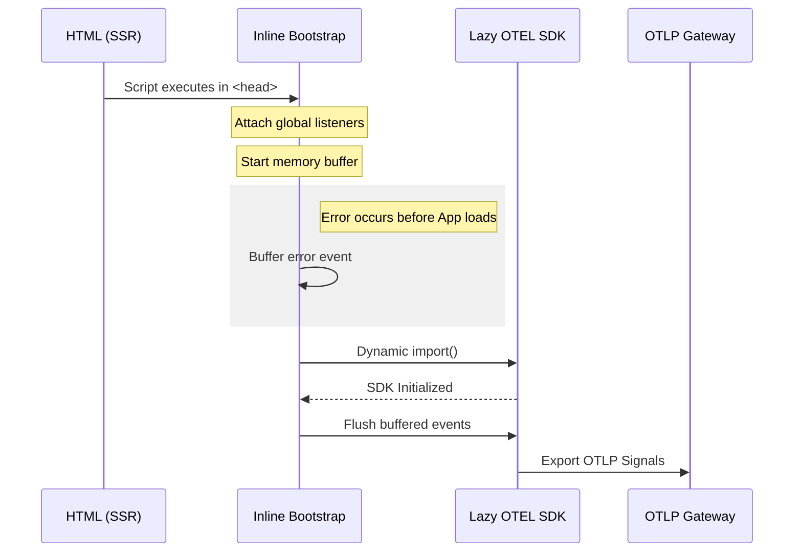
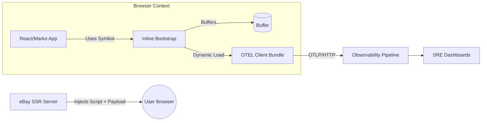

# Real User Monitoring (RUM) Platform: Design & Architecture

This platform provides standardized frontend observability as a default capability of the web platform. It scales across more than **120 applications**, covering roughly **95% of UI surfaces**, including high-traffic customer-facing pages and internal tools. The main goal was to ensure that critical failures, especially those happening during server side rendering or hydration, are captured without hurting browser performance.

---

### The Problem: Fragmented Observability

Before this platform, frontend logging was inconsistent. Teams used disparate schemas, and errors occurring during the initial page load or hydration often went uncaptured. This created a "blind spot" in incident response, as frontend signals did not align with backend OpenTelemetry (OTEL) pipelines.

The goal was to move from an opt-in model to a **platform-wide primitive** where observability is inherited by every application on the web stack.

---

### Architecture Overview

The system is split into three decoupled artifacts to balance reliability with bundle size constraints.



| Layer            | Implementation                     | Purpose                                                                 |
|------------------|------------------------------------|-------------------------------------------------------------------------|
| The Sentinel     | Inlined `<script>` (SSR)            | Critical path: global error listeners and memory buffering. No dependencies. |
| The Heavy Lifter | Lazy-loaded OTEL bundle             | Asynchronous: handles complex logic, OTLP exporting, and retries.        |
| The Bridge       | Framework hooks (React / Marko)     | Ergonomics: provides a standard API for developers without re-initializing the engine. |

---

### 1. The Inline Bootstrap (The Sentinel)

A minimal, zero-dependency script is inlined into the document `<head>` during server-side rendering. This ensures that the system is active before any application JavaScript is parsed or executed.

**Responsibilities:**

* Attach global error and unhandled rejection listeners immediately.
* Buffer failures in memory if the main SDK is not yet available.
* Read server-provided configuration (service name, pool, version) to prevent configuration drift.

```html
<script
  data-inlinepayload='{
    "serviceName": "ebay-checkout-web",
    "endpoint": "prod-otlp-gateway",
    "pool": "checkout-pool-01",
    "serviceVersion": "2.4.5"
  }'
>
(function () {
  const RUM_SYMBOL = Symbol.for("ebay.rum");
  const payload = document.currentScript?.dataset?.inlinepayload;
  const rumConfig = payload ? JSON.parse(payload) : {};

  const buffer = [];
  let otelLogger = null;

  const logger = {
    error(event) {
      if (otelLogger) {
        otelLogger.error(event);
      } else {
        buffer.push(event); // Buffer errors until SDK is ready
      }
    },
  };

  window[RUM_SYMBOL] = { logger };

  window.addEventListener("error", (e) => logger.error(e));
  window.addEventListener("unhandledrejection", (e) => logger.error(e));

  (async function loadOtel() {
    try {
      const otel = await import("/rum-otel-client.js");
      otelLogger = otel.initializeLogger(rumConfig);

      // Flush the buffer once the full SDK is ready
      for (const event of buffer) {
        otelLogger.error(event);
      }
      buffer.length = 0;
    } catch {
      // Observability must fail open to ensure site functionality
    }
  })();
})();
</script>

```

---

### 2. Lazy OTEL Client Bundle

OpenTelemetry provides the standardization required for modern observability but introduces significant bundle weight. To protect performance budgets, the OTEL SDK is loaded dynamically and kept out of the critical rendering path.

This separation allows for the SDK to be updated or tuned (e.g., adjusting sampling rates) globally without requiring individual application teams to rebuild or redeploy their services.

---

### 3. Framework Integration (React / Marko)
The final component is a thin framework layer distributed as a standard npm module. This layer acts as an ergonomic bridge, allowing developers to interact with the pre-initialized runtime without worrying about the underlying implementation.


```ts
import { useRumContext } from "@ebay/rum-react";

const CheckoutButton = () => {
  const { logger } = useRumContext();

  const handlePayment = async () => {
    try {
      await processPayment();
    } catch (err) {
      // Logic is decoupled from the SDK lifecycle
      logger.error({
        message: "Payment Processing Failed",
        context: { errorCode: "EBAY_VAL_001" },
        originalError: err
      });
    }
  };

  return <button onClick={handlePayment}>Complete Purchase</button>;
};

```

```ts
// Inside @ebay/rum-react
const RUM_SYMBOL = Symbol.for("ebay.rum");

export const useRumContext = () => {
  // Retrieve the logger initialized by the inline script
  const runtime = window[RUM_SYMBOL];
  
  if (!runtime) {
    // Fallback to a no-op logger if for some reason the script didn't run
    return { logger: { error: () => {} } };
  }

  return { logger: runtime.logger };
};
```


---

### System Integration Flow

The architecture connects the server-side environment directly to the backend ingestion pipelines, creating a continuous chain of observability from the first byte of HTML to the final log entry.


### Impact and Operational Results

* **Reliability:** Captured failures during the "dead zone" of application initialization that were previously 100% invisible.
* **Performance:** Achieved universal coverage with zero regression in First Input Delay (FID) by deferring SDK initialization to idle time.
* **MTTR Reduction:** By unifying schemas and enabling cross-stack correlation, SREs can now identify the root cause of frontend-impacting incidents in minutes rather than hours.
* **Developer Velocity:** We turned a complex, multi-day instrumentation task into a zero-click platform default.

---
