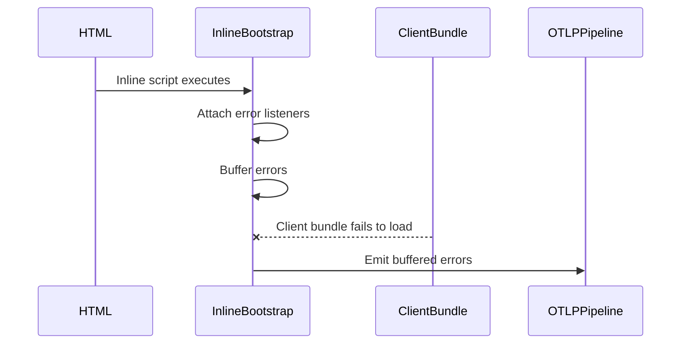
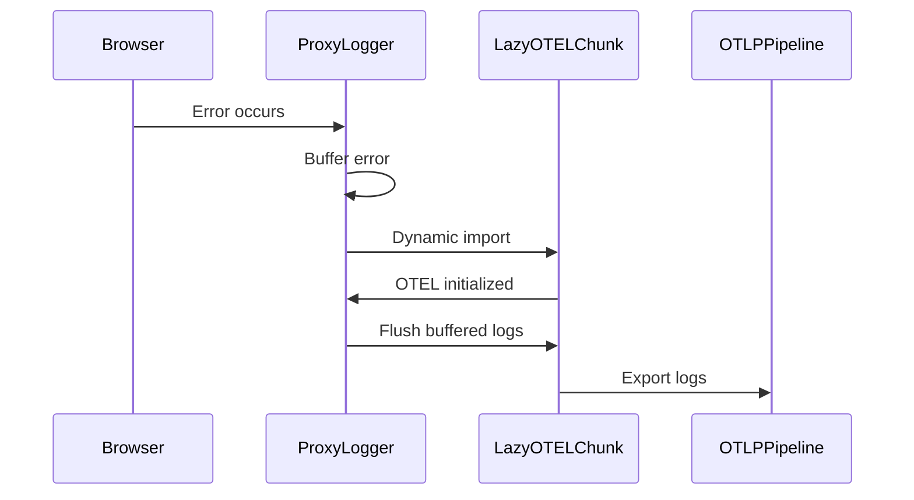
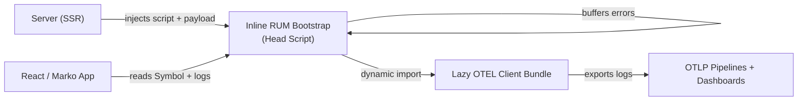

# Real User Monitoring (RUM) Platform  
## Design, Architecture, and Organizational Impact

---

### Executive Summary

Frontend observability across the organization was fragmented and unreliable. While backend services already emitted OpenTelemetry (OTEL) signals into mature pipelines and dashboards, frontend applications lacked a consistent way to capture real user failures. As a result, incidents often had blind spots, teams built their own logging solutions, and it was difficult to correlate frontend failures with backend behavior.

The goal of this work was to make frontend observability a **default capability of the web platform**, rather than an opt-in feature owned by individual teams.

The solution was a client-side RUM platform built on OpenTelemetry that captures failures reliably, preserves browser performance, and integrates cleanly with existing backend observability infrastructure. Over time, this platform scaled from a few early adopters to more than **120 applications**, covering roughly **95% of all UI surfaces**, including both customer-facing and internal tools.

---

### The Problem We Were Solving

Frontend logging across teams had grown organically. Each application handled errors differently, used different schemas, and had different lifecycle assumptions. In practice this meant:

- Errors during SSR or hydration were often invisible  
- Frontend signals did not align with backend OTEL pipelines  
- Adoption required custom setup and ongoing maintenance  
- Incident response was slower and more manual than it needed to be  

These gaps created real operational cost. SREs had limited visibility into user-impacting failures, engineers spent time rebuilding similar tooling, and debugging production issues required stitching together incomplete signals.

---

### Design Goals and Constraints

From the start, a few requirements shaped the design:

- Observability should work even if the application never loads  
- Performance budgets in the browser must be protected  
- Configuration should be owned by the server, not inferred on the client  
- The solution should scale across frameworks without duplication  
- Adoption should be simple enough that teams don’t need to think about it  

At the same time, we had to work within real constraints: heavy OTEL SDKs, CSP and SSR environments, legacy build systems like Lasso and older Webpack versions, and strict bundle size limits on high-traffic pages.

---


### High Level Architecture


Most critical frontend failures occur before or during application load.
To ensure observability in these scenarios, a minimal logging bootstrap is inlined during server-side rendering.



This guarantees visibility even when the application never fully initializes.

---

OpenTelemetry provides standardization and extensibility, but introduces significant bundle weight in the browser.
To protect performance budgets, OTEL is loaded lazily.



---


### The Core Architecture

The most important architectural decision was to split the system into **three cooperating artifacts**, each built separately for clear ownership and performance reasons, but designed to work together as a single runtime.

These artifacts are not independent systems. They are intentionally cohesive, each covering a different phase of the page lifecycle.

---

#### Inline RUM Bootstrap (SSR-Injected)
This is the code that gets stringified and injected by RumInliner.

The first piece is a small inline bundle that is injected into the document head during server-side rendering.

This code runs before any application JavaScript. Its job is simple and deliberately limited:

- Attach global error and unhandled rejection listeners  
- Buffer failures safely in memory  
- Read server-owned configuration from `data-inlinepayload`  
- Lazy-load the OTEL client bundle  
- Flush buffered errors once OTEL is ready  

It does not depend on React or Marko. It does not read client-side environment variables. It does not block page load. Its only responsibility is to make sure failures are captured as early and as safely as possible.

All configuration is passed in from the server using `data-inlinepayload`. This includes things like environment-specific endpoints, service name, deployment pool, and the exact client version. Keeping this server-owned avoids configuration drift and makes debugging failed deployments significantly easier.

```html
<script
  data-inlinepayload='{
    "serviceName": "viewitem",
    "endpoint": "prod-endpoint",
    "pool": "viPool1",
    "serviceVersion": "1.2.34"
  }'
>
(function () {
  const RUM_SYMBOL = Symbol.for("org.rum");

  const payload = document.currentScript?.dataset?.inlinepayload;
  const rumConfig = payload ? JSON.parse(payload) : {};

  const buffer = [];
  let otelLogger = null;

  const logger = {
    error(event) {
      if (otelLogger) {
        otelLogger.error(event);
      } else {
        buffer.push(event);
      }
    },
  };

  window[RUM_SYMBOL] = { logger };

  window.addEventListener("error", (e) => logger.error(e));
  window.addEventListener("unhandledrejection", (e) => logger.error(e));

  (async function loadOtel() {
    try {
      const otel = await import("/rum-otel-client.js");
      otelLogger = otel.initializeLogger(rumConfig);

      for (const event of buffer) {
        otelLogger.error(event);
      }
      buffer.length = 0;
    } catch {
      // Observability must fail open
    }
  })();
})();
</script>
````

---

#### Lazy OTEL Client Bundle

The second piece is a dedicated client bundle that contains all OpenTelemetry dependencies. This bundle is intentionally kept out of the critical path and is only loaded dynamically by the inline bootstrap.

Its responsibilities are straightforward:

* Initialize OTEL using the server-provided configuration
* Export logs to existing OTLP pipelines
* Remain invisible to application code

Separating this bundle keeps initial page load fast and allows OTEL upgrades without touching application bundles.

---

#### Framework Integration (React / Marko)

The third piece is a thin framework layer that lives inside the host application bundle. Its purpose is not to initialize observability, but simply to provide an ergonomic way for application code to interact with the already-running RUM runtime.

```ts
import { useRumContext } from "react-rum/client";

const { logger } = useRumContext();
```

Frameworks never attach listeners, parse payloads, or load OTEL. They only consume a runtime that already exists. This keeps observability independent of UI lifecycles and avoids duplicating logic across frameworks.

---

### How Everything Fits Together



This diagram represents the full system. Everything else is an implementation detail.

---

### Reliability and Performance Characteristics

Because the inline bootstrap runs before application code, errors are captured even when hydration fails or the client bundle never loads. Because OTEL is lazy-loaded, performance budgets remain intact on critical paths. Because configuration is server-owned, observability remains consistent across environments and deployments.

---

### Adoption and Organizational Impact

We started by validating the approach with a small number of teams, including one of the largest and most performance-sensitive surfaces. Once the architecture proved reliable, adoption expanded naturally.

Over time, the platform became the standard integration path for frontend observability:

* More than 120 applications onboarded
* Roughly 95% coverage across UI surfaces
* Shared dashboards and consistent semantics across teams

Perhaps most importantly, teams stopped thinking about *how* to log errors and started focusing on *what the data meant*.

---

### Working Across Teams

This work required close collaboration with SREs to align OTEL semantics, ingestion pipelines, and operational expectations. By building on top of existing backend infrastructure rather than parallel systems, we reduced duplication and accelerated time-to-value.

---

### Looking Forward

The architecture intentionally leaves room for expansion. Client-side tracing and richer signals can be added later without changing the bootstrap or breaking existing integrations. Stability and adoption were prioritized first, with extensibility built into the boundaries.

---

### Closing Thoughts

By centering the design around a small inline bootstrap, a lazy instrumentation bundle, and a thin framework adapter, this work turned frontend observability into a reliable, performance-safe platform capability. The result is better visibility, faster debugging, and a foundation that scales with both the organization and the web stack.
